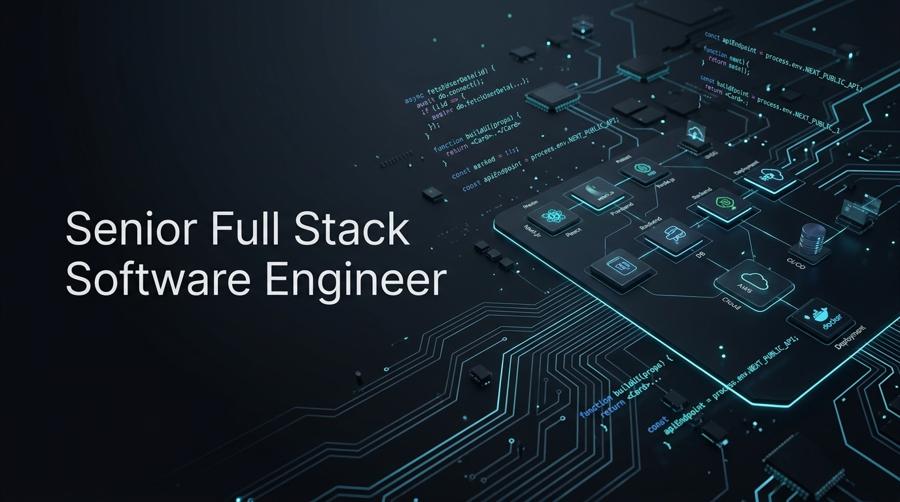

<p align="center">
  
</p>

<p align="center">
  
</p>

# 👋 Olá, eu sou o Arthur Santinati

### Senior Full Stack Developer | Product Engineer & AI Integrator

Engenheiro de Software Full Stack com **mais de 6 anos de experiência profissional** atuando no ciclo completo de produtos digitais — desde a modelagem relacional de banco de dados e arquitetura de microsserviços até interfaces web modernas de alta conversão, aplicativos mobile publicados nas lojas e integração avançada com modelos de **Inteligência Artificial & LLMs**.

Atualmente na **HTeck**, atuo como Desenvolvedor Full Stack Sênior liderando o desenvolvimento de um **sistema ERP completo para indústrias metalúrgicas**, um produto proprietário altamente modular projetado para comercialização B2B.

Possuo sólida vivência na arquitetura de **plataformas SaaS multi-tenant** (com gestão de planos e assinaturas recorrentes), sistemas de agendamento em tempo real com controle de fila de atendimento, módulos de gestão industrial (PCP, produção, estoque, faturamento) e esteiras de entrega contínua com **Docker e Jenkins (CI/CD)**.

---

## 🚀 Portfólio & Demonstrações

🌐 **Portfólio Pessoal:** [https://arthursantinati.netlify.app/](https://arthursantinati.netlify.app/)  
📫 **E-mail:** [arthursantinati02@outlook.com](mailto:arthursantinati02@outlook.com)  
💼 **LinkedIn:** [linkedin.com/in/arthur-santinati](https://www.linkedin.com/in/arthur-santinati/)  
💬 **WhatsApp:** [Conversar Diretamente](https://wa.me/5519999913640?text=Ol%C3%A1%20Arthur%2C%20vi%20seu%20perfil%20no%20GitHub%20e%20gostaria%20de%20conversar.)

---

## 🛠️ Stack Tecnológico & Arquitetura

```
  ┌────────────────────────────────────────────────────────────────────────┐
  │                 Inteligência Artificial & LLMs                         │
  │     OpenAI API • Anthropic Claude • Gemini • Function Calling • RAG    │
  ├────────────────────────────────────────────────────────────────────────┤
  │                               UI / UX                                  │
  │            Tailwind CSS • Shadcn/UI • Zustand • Redux • Figma          │
  ├────────────────────────────────────────────────────────────────────────┤
  │                      Frontend Web & Mobile                             │
  │     Next.js (App Router) • React • TypeScript • React Native (Expo)    │
  ├────────────────────────────────────────────────────────────────────────┤
  │                         Backend & APIs                                 │
  │      NestJS • Node.js • REST APIs • WebSockets • JWT / NextAuth / RBAC │
  ├────────────────────────────────────────────────────────────────────────┤
  │                     Persistência & Modelagem                           │
  │            PostgreSQL • Prisma ORM • MySQL • MongoDB                   │
  ├────────────────────────────────────────────────────────────────────────┤
  │                       DevOps, Infra & CI/CD                            │
  │        Docker • Docker Compose • Jenkins • GitHub Actions • VPS        │
  ├────────────────────────────────────────────────────────────────────────┤
  │                      Sistemas & Negócio                                │
  │    ERPs Industriais • SaaS Multi-tenant • Assinaturas • Pagamentos     │
  └────────────────────────────────────────────────────────────────────────┘
```

---

## 🌟 Projetos & Estudos de Caso de Destaque

### 💇 **Blow — Plataforma & App de Agendamento para Salões**
- **Escopo:** Plataforma completa composta por aplicativo mobile para clientes e painel administrativo web interativo para recepção e gestão.
- **Diferencial Técnico:** Fila de profissionais sincronizada em tempo real via WebSockets; fluxo de autenticação seguro; controle rigoroso de concorrência na marcação de horários; perfis de acesso especializados (Recepcionista, Gestor, Profissional).
- **Stack:** `React Native` • `Next.js` • `TypeScript` • `NestJS` • `Node.js` • `Prisma` • `PostgreSQL` • `WebSockets`

### 🚗 **SaaS Multi-tenant de Gestão de Oficinas Mecânicas**
- **Escopo:** Plataforma web 100% responsiva para centros automotivos com gestão completa de planos e assinaturas com cobrança recorrente.
- **Diferencial Técnico:** Isolamento de dados multi-tenant; emissão e fluxo de Ordens de Produção/Serviço (OP/OS); controle de veículos dos clientes; ponto eletrônico para colaboradores/mecânicos; controle e baixa de estoque de peças automotivas; dashboards operacionais e financeiros.
- **Stack:** `Next.js` • `TypeScript` • `NestJS / Node.js` • `Prisma` • `PostgreSQL` • `Gateways de Pagamento` • `Tailwind CSS`

### 🏭 **HTeck ERP Industrial — Sistema ERP para Metalúrgicas**
- **Escopo:** Sistema ERP corporativo modular completo desenvolvido para a cadeia produtiva de indústrias metalúrgicas — preparado para comercialização B2B.
- **Diferencial Técnico:** Modelagem de regras industriais densas (Planejamento e Controle da Produção - PCP, engenharia de produto, rastreabilidade de lotes, estoque de matéria-prima e produtos acabados, compras e faturamento); garantia de consistência transacional estrita (ACID); esteira CI/CD conteinerizada com Docker e Jenkins.
- **Stack:** `Next.js` • `TypeScript` • `NestJS` • `Prisma` • `PostgreSQL` • `Docker` • `Jenkins (CI/CD)`

### 📊 **Vitta Insight — Dashboard Analítico & Plataforma Operacional**
- **Escopo:** Monorepo pnpm corporativo (`apps/web`, `apps/api`, `packages/shared`) para registro rápido de atendimentos em lojas físicas e inteligência de vendas.
- **Diferencial Técnico:** Autenticação granular por perfil (Admin, Gerente e vendedor via PIN rápido); banco relacional no PostgreSQL 16 conteinerizado via Docker Compose com migrations e seeds idempotentes; alta densidade de dados analíticos.
- **Stack:** `Next.js 15 (PWA)` • `NestJS` • `Prisma` • `PostgreSQL 16` • `Docker Compose` • `TypeScript` • `Tailwind CSS`

---

## 💼 Experiência Profissional

### **Desenvolvedor Full Stack Sênior** — HTeck  
⏳ *Ago/2026 – Presente*  
- Liderança técnica e arquitetura de software no desenvolvimento do ERP corporativo completo para metalúrgicas.
- Desenvolvimento de ponta a ponta dos módulos industriais: PCP, engenharia fabril, controle de estoque de insumos, compras, faturamento e financeiro.
- Implementação de APIs escaláveis e de alta confiabilidade com NestJS, Prisma e PostgreSQL com transações ACID.
- Estruturação de pipelines de integração e deploy contínuo (CI/CD) com Docker e Jenkins.

### **Desenvolvedor Full Stack** — Hybriun Desenvolvimento  
⏳ *Jul/2025 – Jul/2026*  
- Arquitetura e desenvolvimento de aplicações web modernas (Next.js/React) e aplicativos móveis multiplataforma (React Native com publicação nas lojas Google Play e App Store).
- Implementação de APIs REST escaláveis e tipadas com NestJS e modelagem relacional com MySQL.
- Integração de meios de pagamento digitais (Stripe e Pagar.me) com processamento seguro de webhooks.

### **Desenvolvedor Front-End** — ASC Solutions  
⏳ *Mar/2023 – Jul/2025*  
- Desenvolvimento do aplicativo de **Sócio-Torcedor** com carteira digital via QR Code para catracas de estádios, catálogo de produtos e gestão de dependentes.
- Criação de plataforma de gerenciamento de eventos (shows e jogos) com monitoramento em tempo real e controle de público integrado a catracas.
- Integração direta com gateway Cielo (PIX, boleto e cartão de crédito).
- Desenvolvimento web com Angular e mobile com Ionic, incluindo publicação e manutenção nas lojas oficiais.

### **Desenvolvedor Front-End** — Dopster.io  
⏳ *Jul/2022 – Mar/2023*  
- Desenvolvimento de plataformas médicas e soluções em governança corporativa/ESG com ênfase em dados ao vivo via WebSockets.
- Autenticação segura com JWT e NextAuth; gerenciamento de estado complexo com Zustand e Redux.
- Validação estrita de formulários e contratos de dados com React Hook Form e Zod.

---

## 📊 Estatísticas do GitHub

<div align="center">
  
</div>

---

## 📫 Contato & Parcerias

<p align="center">
  <a href="mailto:arthursantinati02@outlook.com" target="_blank"></a>
  <a href="https://www.linkedin.com/in/arthur-santinati/" target="_blank"></a>
  <a href="https://arthursantinati.netlify.app/" target="_blank"></a>
</p>

<p align="center">
  Aberto a posições sênior, desenvolvimento de produtos digitais, sistemas ERP, projetos SaaS e consultoria de arquitetura.
</p>
